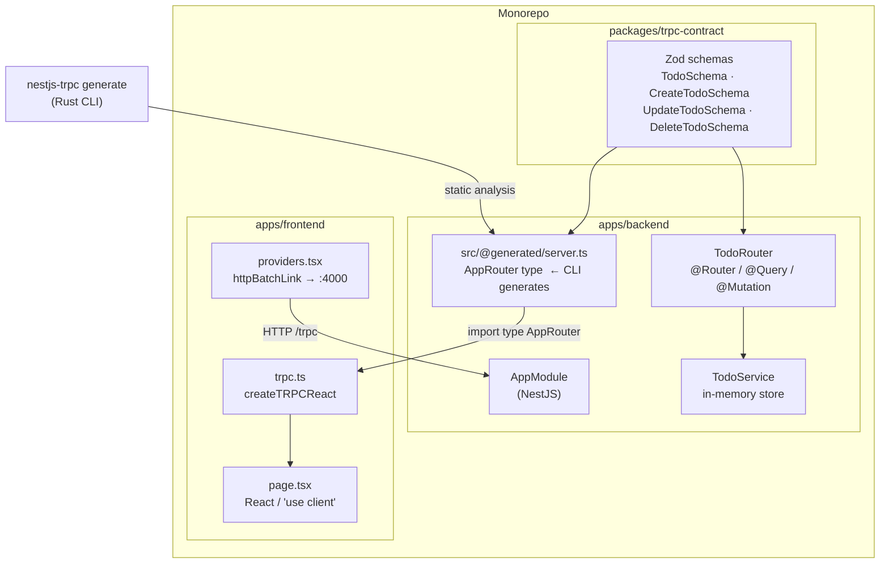
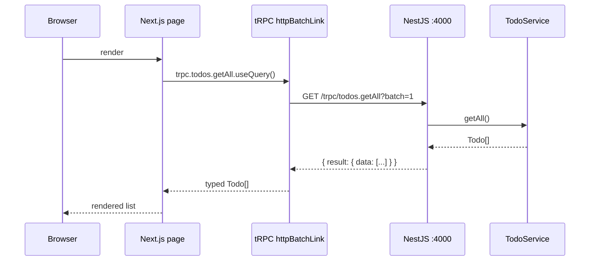
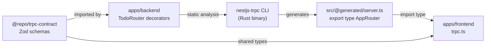
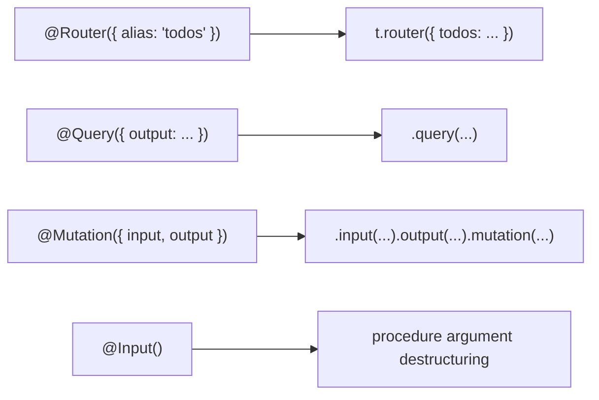
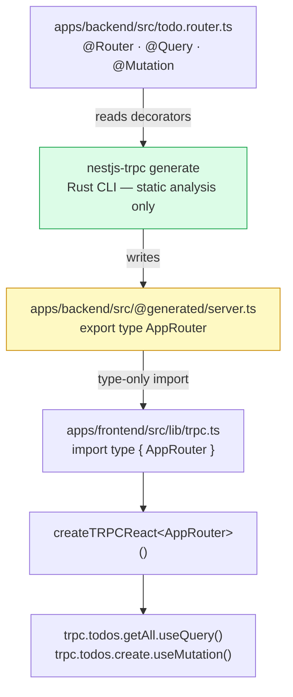
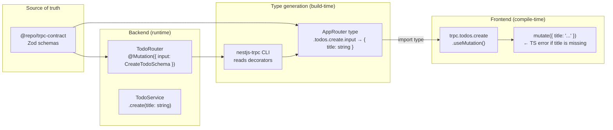
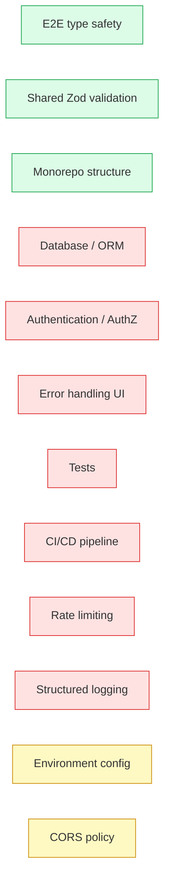

# Building a NestJS + Next.js + tRPC Monorepo — Step-by-Step Tutorial

> **Stack:** NestJS v11 · Next.js v16 · tRPC v11 · nestjs-trpc v2.9.1 · Zod v4 · pnpm workspaces · Turborepo · TypeScript 6

---

## Table of Contents

1. [Architecture Overview](#1-architecture-overview)
2. [Prerequisites](#2-prerequisites)
3. [Monorepo Scaffold](#3-monorepo-scaffold)
4. [Shared Contract Package](#4-shared-contract-package)
5. [NestJS Backend](#5-nestjs-backend)
6. [Next.js Frontend](#6-nextjs-frontend)
7. [Wiring the tRPC Client](#7-wiring-the-trpc-client)
8. [Running the Stack](#8-running-the-stack)
9. [How Type Safety Flows](#9-how-type-safety-flows)
10. [Production Readiness Analysis](#10-production-readiness-analysis)

---

## 1. Architecture Overview

### Monorepo structure

```
trpc-todo/
├── apps/
│   ├── backend/               # NestJS — tRPC server on :4000
│   └── frontend/              # Next.js — tRPC client on :3000
├── packages/
│   └── trpc-contract/         # Shared Zod schemas (no runtime dep on either app)
├── pnpm-workspace.yaml
├── turbo.json
└── package.json
```

### Component diagram



### Request / response flow



### Type sharing mechanism



---

## 2. Prerequisites

| Tool | Version | Notes |
|------|---------|-------|
| Node.js | ≥ 22 (LTS) | `node --version` |
| pnpm | ≥ 10 | `npm i -g pnpm` |
| NestJS CLI | ≥ 11 | `pnpm add -g @nestjs/cli` |

---

## 3. Monorepo Scaffold

### 3.1 Root package.json

```bash
mkdir trpc-todo && cd trpc-todo
```

```json
{
  "name": "trpc-todo-monorepo",
  "private": true,
  "scripts": {
    "dev": "turbo run dev",
    "build": "turbo run build"
  },
  "devDependencies": {
    "turbo": "^2.5.4",
    "typescript": "^6.0.3"
  },
  "packageManager": "pnpm@10.11.0"
}
```

### 3.2 pnpm-workspace.yaml

```yaml
packages:
  - apps/*
  - packages/*
ignoredBuiltDependencies:
  - '@nestjs/core'
  - sharp
```

### 3.3 turbo.json

```json
{
  "$schema": "https://turbo.build/schema.json",
  "tasks": {
    "build": { "dependsOn": ["^build"], "outputs": ["dist/**", ".next/**"] },
    "dev":   { "persistent": true, "cache": false }
  }
}
```

---

## 4. Shared Contract Package

This package holds the Zod schemas. Both the backend (for validation) and the frontend (for client-side types) depend on it. Neither app owns the schemas — they're a shared source of truth.

```bash
mkdir -p packages/trpc-contract/src
```

**`packages/trpc-contract/package.json`**

```json
{
  "name": "@repo/trpc-contract",
  "version": "0.0.1",
  "main": "./src/index.ts",
  "types": "./src/index.ts",
  "exports": { ".": "./src/index.ts" },
  "dependencies": { "zod": "^4.4.3" }
}
```

**`packages/trpc-contract/src/index.ts`**

```typescript
import { z } from "zod";

export const TodoSchema = z.object({
  id: z.string(),
  title: z.string(),
  completed: z.boolean(),
  createdAt: z.string(),
});

export const CreateTodoSchema = z.object({
  title: z.string().min(1, "Title is required"),
});

export const UpdateTodoSchema = z.object({
  id: z.string(),
  title: z.string().min(1).optional(),
  completed: z.boolean().optional(),
});

export const DeleteTodoSchema = z.object({
  id: z.string(),
});

export type Todo = z.infer<typeof TodoSchema>;
export type CreateTodo = z.infer<typeof CreateTodoSchema>;
export type UpdateTodo = z.infer<typeof UpdateTodoSchema>;
```

> **Why a separate package?** Because `@generated/server.ts` (produced by the CLI) re-imports from `@repo/trpc-contract`. If schemas lived inside `apps/backend`, the frontend would transitively depend on NestJS internals — a circular mess. The contract package has zero framework dependencies.

---

## 5. NestJS Backend

### 5.1 Scaffold

```bash
cd apps
nest new backend --package-manager pnpm --skip-git
cd backend
pnpm add nestjs-trpc @trpc/server zod@^4.4.3 @repo/trpc-contract
pnpm add -D @nestjs/cli @nestjs/schematics @types/node typescript
```

Remove the default `app.controller.ts`, `app.service.ts`, and their spec files.

### 5.2 tsconfig.json

NestJS + TypeScript 6 requires three additions over the default:

```json
{
  "compilerOptions": {
    "module": "commonjs",
    "declaration": true,
    "emitDecoratorMetadata": true,
    "experimentalDecorators": true,
    "allowSyntheticDefaultImports": true,
    "target": "ES2021",
    "sourceMap": true,
    "outDir": "./dist",
    "rootDir": "./src",
    "baseUrl": "./",
    "ignoreDeprecations": "6.0",
    "types": ["node"],
    "incremental": true,
    "skipLibCheck": true,
    "strictNullChecks": false
  }
}
```

Key differences from the NestJS default:
- `rootDir: "./src"` — required by TS6 when `outDir` is set
- `ignoreDeprecations: "6.0"` — silences `baseUrl` deprecation (removed in TS7)
- `types: ["node"]` — explicitly pulls in Node built-ins (`crypto`, `Buffer`, etc.)

### 5.3 TodoService — in-memory store

**`src/todo.service.ts`**

```typescript
import { Injectable } from "@nestjs/common";
import { Todo } from "@repo/trpc-contract";
import { randomUUID } from "crypto";

@Injectable()
export class TodoService {
  private todos: Todo[] = [
    { id: randomUUID(), title: "Buy groceries", completed: false, createdAt: new Date().toISOString() },
    { id: randomUUID(), title: "Read a book",   completed: true,  createdAt: new Date().toISOString() },
  ];

  getAll(): Todo[] { return this.todos; }

  create(title: string): Todo {
    const todo: Todo = { id: randomUUID(), title, completed: false, createdAt: new Date().toISOString() };
    this.todos.push(todo);
    return todo;
  }

  update(id: string, data: { title?: string; completed?: boolean }): Todo {
    const todo = this.todos.find(t => t.id === id);
    if (!todo) throw new Error(`Todo ${id} not found`);
    if (data.title     !== undefined) todo.title     = data.title;
    if (data.completed !== undefined) todo.completed = data.completed;
    return todo;
  }

  delete(id: string): boolean {
    const idx = this.todos.findIndex(t => t.id === id);
    if (idx === -1) throw new Error(`Todo ${id} not found`);
    this.todos.splice(idx, 1);
    return true;
  }
}
```

### 5.4 TodoRouter — tRPC procedures as NestJS decorators

**`src/todo.router.ts`**

```typescript
import { Injectable } from "@nestjs/common";
import { Router, Query, Mutation, Input } from "nestjs-trpc";
import { z } from "zod";
import { TodoSchema, CreateTodoSchema, UpdateTodoSchema, DeleteTodoSchema } from "@repo/trpc-contract";
import { TodoService } from "./todo.service";

@Injectable()
@Router({ alias: "todos" })
export class TodoRouter {
  constructor(private readonly todoService: TodoService) {}

  @Query({ output: z.array(TodoSchema) })
  getAll() { return this.todoService.getAll(); }

  @Mutation({ input: CreateTodoSchema, output: TodoSchema })
  create(@Input() input: z.infer<typeof CreateTodoSchema>) {
    return this.todoService.create(input.title);
  }

  @Mutation({ input: UpdateTodoSchema, output: TodoSchema })
  update(@Input() input: z.infer<typeof UpdateTodoSchema>) {
    return this.todoService.update(input.id, { title: input.title, completed: input.completed });
  }

  @Mutation({ input: DeleteTodoSchema, output: z.boolean() })
  delete(@Input() input: z.infer<typeof DeleteTodoSchema>) {
    return this.todoService.delete(input.id);
  }
}
```

#### Key decorator mapping



### 5.5 AppModule

**`src/app.module.ts`**

```typescript
import { Module } from "@nestjs/common";
import { TRPCModule } from "nestjs-trpc";
import { TodoRouter } from "./todo.router";
import { TodoService } from "./todo.service";

@Module({
  imports: [TRPCModule.forRoot({})],
  providers: [TodoRouter, TodoService],
})
export class AppModule {}
```

> **Note:** In nestjs-trpc v2.9.1, `TRPCModule.forRoot()` no longer accepts `autoSchemaFile`. Type generation is now done by the CLI (see §5.6).

### 5.6 main.ts

**`src/main.ts`**

```typescript
import "reflect-metadata";
import { NestFactory } from "@nestjs/core";
import { AppModule } from "./app.module";

async function bootstrap() {
  const app = await NestFactory.create(AppModule);
  app.enableCors({ origin: "http://localhost:3000" });
  await app.listen(4000);
  console.log("🚀 Backend running on http://localhost:4000/trpc");
}
bootstrap();
```

### 5.7 nestjs-trpc generate — the CLI

In v2.9.1 the `autoSchemaFile` option was removed. A standalone Rust CLI now statically analyses your `*.router.ts` files and emits `src/@generated/server.ts` — no NestJS bootstrap required.

```bash
# One-shot generation
pnpm nestjs-trpc generate

# Watch mode (used in dev)
pnpm nestjs-trpc watch
```

The generated file looks like this:

```typescript
// AUTO-GENERATED — DO NOT EDIT
import { initTRPC } from "@trpc/server";
import { z } from "zod";
import { TodoSchema, CreateTodoSchema, UpdateTodoSchema, DeleteTodoSchema } from "@repo/trpc-contract";

const t = initTRPC.create();
const publicProcedure = t.procedure;

const appRouter = t.router({
  todos: t.router({
    getAll: publicProcedure.output(z.array(TodoSchema)).query(async () => "PLACEHOLDER" as any),
    create: publicProcedure.input(CreateTodoSchema).output(TodoSchema).mutation(async () => "PLACEHOLDER" as any),
    update: publicProcedure.input(UpdateTodoSchema).output(TodoSchema).mutation(async () => "PLACEHOLDER" as any),
    delete: publicProcedure.input(DeleteTodoSchema).output(z.boolean()).mutation(async () => "PLACEHOLDER" as any),
  })
});

export type AppRouter = typeof appRouter;
```

> The implementations are `PLACEHOLDER` stubs — this file is **only ever imported as a type**. The real procedures are wired at runtime by NestJS.

Update `package.json` scripts:

```json
{
  "scripts": {
    "generate": "nestjs-trpc generate",
    "build":    "pnpm generate && nest build",
    "dev":      "nestjs-trpc watch & nest start --watch",
    "start":    "node dist/main"
  }
}
```

### 5.8 .gitignore

Add the generated directory — it's a build artifact:

```
apps/backend/src/@generated
```

---

## 6. Next.js Frontend

### 6.1 Scaffold

```bash
cd apps
pnpm create next-app frontend --typescript --app --no-tailwind --no-eslint --src-dir
cd frontend
pnpm add @trpc/client @trpc/react-query @trpc/server @tanstack/react-query
```

### 6.2 tsconfig.json

Next.js 16 will auto-patch the config on first build, but set these upfront:

```json
{
  "compilerOptions": {
    "target": "ES2017",
    "lib": ["dom", "dom.iterable", "esnext"],
    "allowJs": true,
    "skipLibCheck": true,
    "strict": true,
    "noEmit": true,
    "esModuleInterop": true,
    "module": "esnext",
    "moduleResolution": "bundler",
    "resolveJsonModule": true,
    "isolatedModules": true,
    "jsx": "react-jsx",
    "incremental": true,
    "plugins": [{ "name": "next" }],
    "paths": { "@/*": ["./*"] }
  },
  "include": [
    "next-env.d.ts",
    "**/*.ts",
    "**/*.tsx",
    ".next/types/**/*.ts",
    ".next/dev/types/**/*.ts",
    "../backend/src/@generated/**/*.ts"
  ],
  "exclude": ["node_modules"]
}
```

The last `include` entry (`../backend/src/@generated/**/*.ts`) is the key: it tells TypeScript to include the generated router type file even though it lives outside the frontend app boundary.

### 6.3 tRPC client setup

**`src/lib/trpc.ts`** — React Query integration

```typescript
import { createTRPCReact } from "@trpc/react-query";
import type { AppRouter } from "../../../backend/src/@generated/server";

export const trpc = createTRPCReact<AppRouter>();
```

**`src/lib/trpc-client.ts`** — vanilla client for non-React contexts

```typescript
import { createTRPCClient, httpBatchLink } from "@trpc/client";
import type { AppRouter } from "../../../backend/src/@generated/server";

export const trpcClient = createTRPCClient<AppRouter>({
  links: [httpBatchLink({ url: "http://localhost:4000/trpc" })],
});
```

### 6.4 Providers

**`src/app/providers.tsx`**

```typescript
"use client";
import { QueryClient, QueryClientProvider } from "@tanstack/react-query";
import { httpBatchLink } from "@trpc/client";
import { useState } from "react";
import { trpc } from "../lib/trpc";

export function Providers({ children }: { children: React.ReactNode }) {
  const [queryClient] = useState(() => new QueryClient());
  const [trpcClient]  = useState(() =>
    trpc.createClient({
      links: [httpBatchLink({ url: "http://localhost:4000/trpc" })],
    })
  );
  return (
    <trpc.Provider client={trpcClient} queryClient={queryClient}>
      <QueryClientProvider client={queryClient}>{children}</QueryClientProvider>
    </trpc.Provider>
  );
}
```

### 6.5 Layout

**`src/app/layout.tsx`**

```typescript
import type { Metadata } from "next";
import { Providers } from "./providers";

export const metadata: Metadata = { title: "tRPC Todo" };

export default function RootLayout({ children }: { children: React.ReactNode }) {
  return (
    <html lang="en">
      <body>
        <Providers>{children}</Providers>
      </body>
    </html>
  );
}
```

### 6.6 not-found.tsx

Next.js 16 requires an explicit not-found page:

```typescript
export default function NotFound() {
  return <main><h1>404</h1><p>Page not found.</p></main>;
}
```

---

## 7. Wiring the tRPC Client

The `AppRouter` type flows from backend to frontend without any runtime code crossing the app boundary:



**Why `import type` works across app boundaries**

TypeScript resolves `import type` purely at compile time — no runtime module resolution is attempted. The `../../../backend/src/@generated/server` path is only ever read by `tsc` during type checking; the frontend bundle never loads it.

---

## 8. Running the Stack

```bash
# 1. Install everything from the workspace root
pnpm install

# 2. Generate the AppRouter type (once, or run automatically in dev)
cd apps/backend && pnpm generate

# 3. Terminal A — backend (watch + auto-regenerate on router changes)
cd apps/backend && pnpm dev

# 4. Terminal B — frontend
cd apps/frontend && pnpm dev
```

Or from the root with Turborepo:

```bash
pnpm dev   # runs both apps in parallel via turbo
```

---

## 9. How Type Safety Flows

End-to-end type safety is achieved with **zero manual type sharing** between the backend and frontend codebases:



If you rename a field in `CreateTodoSchema`, TypeScript will error on the frontend call site immediately — no code generation step needed, no runtime surprise.

---

## 10. Production Readiness Analysis

### Overall assessment

```
PoC / Learning project ●●●●●●●●○○  8/10
Team starter template  ●●●●●●○○○○  6/10
Production-ready       ●●●○○○○○○○  3/10
```

This PoC successfully demonstrates end-to-end type safety between NestJS and Next.js via tRPC. It is an excellent template for a new project. It is **not** production-ready as-is.

---

### Pros

| Area | Strength |
|------|----------|
| **Type safety** | Full E2E types from Zod schema → NestJS procedure → React hook, with no duplicated type definitions |
| **DX** | `nestjs-trpc watch` + `nest start --watch` means changing a procedure signature immediately surfaces TS errors in the frontend without any manual steps |
| **NestJS DI** | Routers are injectable classes — middleware, guards, interceptors, and other NestJS features work normally |
| **Monorepo structure** | Clean separation: shared contract, backend app, frontend app — each independently deployable |
| **Zod v4** | Single validation library on both sides. Zod v4 is ~14× faster than v3 for complex schemas |
| **tRPC v11** | Supports React 19, Next.js 16 App Router, httpBatchLink, WebSocket subscriptions |
| **CLI generation** | nestjs-trpc v2.9.1's Rust CLI generates types in milliseconds without bootstrapping the whole NestJS app |

---

### Cons & Caveats

| Area | Issue | Mitigation |
|------|-------|------------|
| **No persistence** | `TodoService` uses an in-memory `[]`. Data resets on restart. | Replace with Prisma + PostgreSQL |
| **No authentication** | Every tRPC procedure is publicly accessible | Add NestJS Guards + JWT via `TRPCModule.forRoot({ context })` |
| **No error boundaries** | Unhandled mutations crash silently on the frontend | Add `onError` to mutations; add React error boundaries |
| **CORS hardcoded** | `origin: "http://localhost:3000"` is baked into `main.ts` | Read from env var; restrict per-environment |
| **Cross-app type import** | Frontend imports from `../../../backend/src/@generated/server` — a fragile relative path across workspace apps | Extract `AppRouter` into a dedicated `@repo/trpc-types` package post-generation |
| **Generated file gitignored** | New developers must run `pnpm generate` before the frontend compiles | Add to CI `postinstall` or a workspace `prepare` script |
| **nestjs-trpc peer dep lag** | v2.9.1 declares peer `@nestjs/common ^9||^10` — NestJS 11 works but produces warnings | Wait for a nestjs-trpc release that declares ^11 |
| **No tests** | Zero test coverage | Add Jest + Supertest for backend; Vitest + Testing Library for frontend |
| **No rate limiting** | Procedures have no rate limits | Add `@nestjs/throttler` |
| **No logging / tracing** | No structured logs, no OpenTelemetry | Add Pino logger; wire OpenTelemetry to tRPC `onError` |
| **HTTP only** | No WebSocket support wired | tRPC v11 supports subscriptions via `wsLink` |

---

### Production gap checklist



---

### Recommended next steps (priority order)

1. **Database** — add Prisma with PostgreSQL. Replace `TodoService`'s array with `prisma.todo.findMany()` etc.
2. **Auth** — add `@nestjs/passport` + `passport-jwt`. Pass the decoded user in `TRPCContext` so procedures can guard by role.
3. **Error handling** — add a `TRPCErrorHandler` class to `TRPCModule.forRoot({ onError })` and React error boundaries on the frontend.
4. **Environment config** — use `@nestjs/config` on the backend; `NEXT_PUBLIC_API_URL` env var on the frontend.
5. **Tests** — Jest + `@nestjs/testing` for the backend; Vitest + `@testing-library/react` for the frontend.
6. **CI** — GitHub Actions: `pnpm install` → `pnpm build` → test matrix.
7. **Type package** — move `@generated/server.ts` output to `packages/trpc-types` so the frontend import is `@repo/trpc-types` rather than a relative cross-app path.
